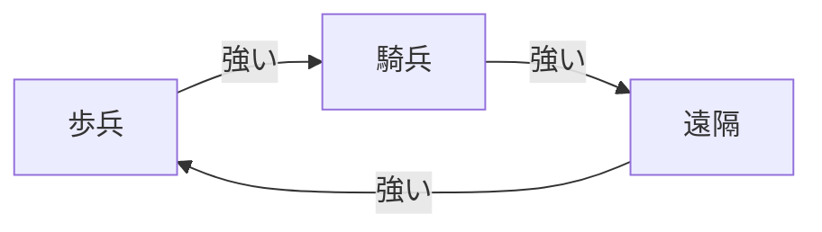

# Anno 117: Pax Romana 軍事・戦闘ガイド（草稿）

---

## 戦闘の基本

- Anno 117 の戦闘は **陸戦** と **海戦** の2系統に分かれる。
- 戦闘の中心は **総督のヴィラ** を巡る攻防。各島の防衛の要であり、敵の総督のヴィラを制圧するとその島全体を奪取できる。
- **士気** が重要システム。HPとは別に管理する必要があり、戦闘中に士気が下がりすぎると部隊が**敗走**する。敗走した部隊は近くの味方の士気にも悪影響を与え、より大規模な総崩れに発展しうる。
- 陸戦ユニットは**相性型**で設計されている:
  - **歩兵**は騎兵に強い
  - **弓兵・投石兵** 遠隔ユニットは歩兵に強く、騎兵に弱い
  - **騎兵**は遠隔ユニットに強く、歩兵に弱い。

  - **攻城兵器**は敵部隊を対象とした**バリスタ**と建物を対象とした**カタパルト**がある。

### ユニット・艦船の操作・スタンス

- 個別選択のほか、ドラッグで全部隊・全艦隊を一括選択できる。
- 攻撃は対象を選んで敵を選択。移動する敵を狙う際はゲームを一時停止すると照準しやすい。
- スタンスは陸・海ともに共通の3種:
  - **積極**: 敵が近づくと命令を放棄して攻撃する
  - **規律**: 命令を決して放棄しない
  - **回避**: 攻撃されると命令を放棄して逃走する
- 陸戦ユニットには**オート戦闘**ボタンもあり、戦闘を自動処理できる。

---

## 陸軍

### 兵舎と徴募

- 陸戦ユニットは**兵舎**で徴募する。兵舎は人口を一定以上に増やし、労働力と軍隊の両方を維持できるようになると解禁される。
- キャンペーンでは**第2幕**で兵舎と防御施設が導入される。
- 最初に徴募できる基本ユニットは**歩兵（アウクシリア）**と**弓兵**。それ以上のユニットタイプは研究と信仰の上昇で解禁される。

### ユニットの4分類

陸戦ユニットは4タイプに分かれ、それぞれ専用の徴募建物を持つ:

| 分類 | 代表ユニット | 備考 |
|------|------------|------|
| 歩兵 | アウクシリア/ ローマ軍団兵 /ムルミロ剣闘士 | 武器が必要。軍団兵には高価な鎧の生産が必要 |
| 遠隔 | 弓兵 / 投石兵 | 距離を保って戦う |
| 騎兵 | 騎兵隊 / 近衛騎兵 | 高い機動性 |
| 攻城兵器 | バリスタ / カタパルト | 部隊攻撃 / 建物・防御施設 |

- **ローマ軍団兵**は高性能ユニットで、スキルツリーから解禁。生産に高価な鎧が必要。
- **騎兵**は市民スキルツリーの「エポナの蹄音」研究を完了すると解禁される。この研究は動物系生産チェーン・物流速度の強化や農業サイロの解禁も伴う。

### 兵装と資源・維持コスト

- 歩兵には武器が必要。
- すべてのユニットは徴兵に資源と資金が必要で、さらに**維持費**と**維持に必要な労働力**がかかる。軍事力が人口・経済の安定に直結する設計。
- 部隊を徴兵すると**労働力が減少する**。徴兵と並行して住宅を建設・アップグレードし続けるとよい。
- 防衛時も攻撃時も、近接と遠隔を混在させたバランスの良い編成が望ましい。

> **盲点Tips**: 他の島との間で兵の労働力移動ができる。部隊を選択して「労働力」→他の島を指定すると移動できる。人口に余裕のある島から移動させると、労働力を圧迫せず徴兵できる。

---

## 海軍

### 造船所と艦船建造

- 艦船は**造船所**で建造する。造船所は港湾建設タブから建てられ、十分な住民（プレブス・リベルトゥス、あるいは特定の都市ステータス到達）が必要。
- 建造前に**ロープ**と**帆**の生産が必要。建造には資金と資源を要する。
- 造船所では2系統を建造できる:
  - **民間船**: 物資・市民の輸送用
  - **軍船**: 海上での戦闘用

### 艦船タイプ（小型→大型）

| 艦船 | 解禁条件 |
|------|---------|
| ペンテコンター | 基本 |
| 三段櫂船（トライリーメ） | 中位 |
| 五段櫂船（クィンクェレメ） | 研究で解禁 |

- 大型艦ほど搭載できるモジュールが多く、貨物や陸戦部隊の積載量も増える。
- 同盟相手から購入する艦船は高価で、改造不可。

### 艦船モジュール（武装・性能）

| モジュール | 機能 |
|-----------|------|
| 船上弓兵 | 射程は短いが攻撃スピードが速い。船同士の戦闘に必須。追加の人手を要する |
| 船上バリスタ | 中距離戦闘に強い。陸・海両用の攻撃に有用。追加の乗員が必要 |
| 船上カタパルト | 低速・低命中だが高威力。建物の攻撃にベスト |
| マスト | 追い風時の最大速度を上げる |
| オール | 機動力を上げ風への依存を減らす（労働力コスト増） |
| 船体装甲 | 被ダメージへの耐久力を上げる。実装に防具が必要 |

- 攻撃モジュール3種（船上弓兵・バリスタ・カタパルト）は射程・命中精度・連射速度・威力が異なり、状況によって使い分ける。
  - 船上弓兵: 射程が限られ、**防御施設を破壊できない**
  - 船上カタパルト: 低速・不正確だが高威力
- モジュール構成は自動保存され、別構成にするには手動でリセットが必要。

### 艦隊運用

- 1隻ずつ選択するか、ドラッグで艦隊全体を一括操作できる。
- 艦隊は敵艦との戦闘・他島との交易・陸戦部隊を運んで敵の総督のヴィラを攻撃する、といった用途に使える。

---

## 防衛

- 防御施設には**木柵**・**石壁**・**防御塔（射手塔）**などがある。
  - 耐久力は 木製 ＜ 石造り 
  - 石壁は砲兵でなければ破壊できない。
  - 防御塔（特に射手塔）は侵攻してくる敵に反撃し、大きなダメージを与える防衛の要。
- **敵はビーチ（砂浜）からのみ侵攻してくる**。そのため壁は砂浜のアクセス地点に集中させるのが効率的（島全周を囲む必要はない）。
  - 戦術例: 全ビーチを壁で塞ぎ、1か所だけ開けて誘い込む。門を使わず一点に敵を誘導して集中砲火する。
- **軍事系の研究**で:
  - 壁の建設コストと維持費を下げられる。
  - **水上に防御塔を建てられる**技術が解禁され、沿岸防衛を拡張できる。
- **総督のヴィラ**は新機能を解禁し、部隊を駐留させられる重要建物。木製壁と射手塔で守ることが推奨される。

---

## いつ戦うか・交易するか（戦略メモ）

- 戦闘は資源・資金・労働力を消費し、維持費も継続的にかかるため、軍備は経済・人口の安定とのバランスが重要。
- むやみな拡張より、相性編成（近接＋遠隔＋騎兵＋砲兵）と防衛施設の効率配置が鍵。
- 交易・外交で解決できる局面と、軍事制圧すべき局面の見極めが推奨される。
